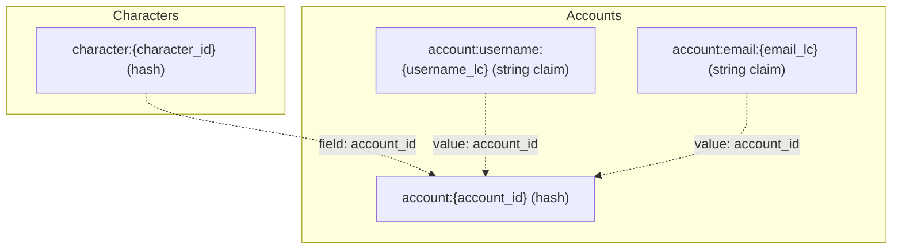
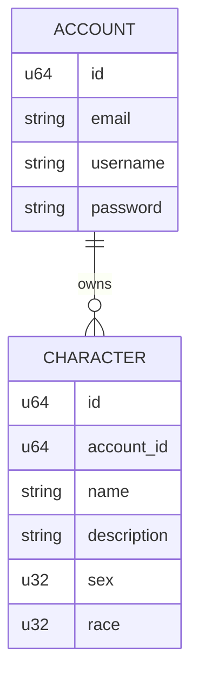
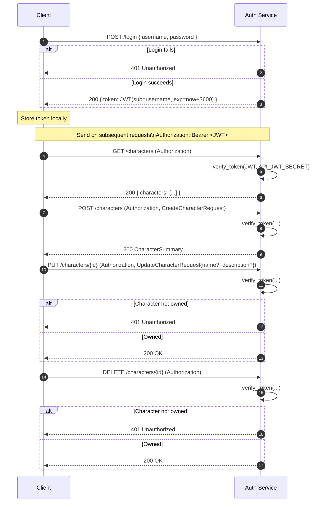
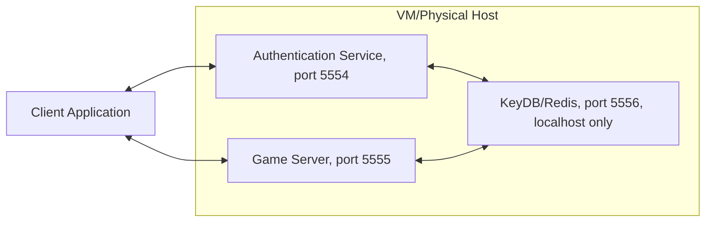
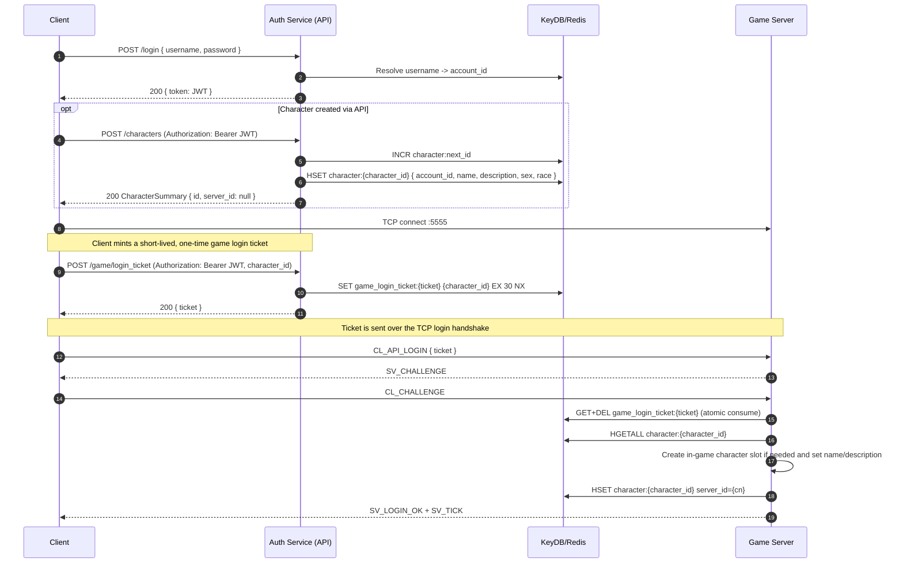
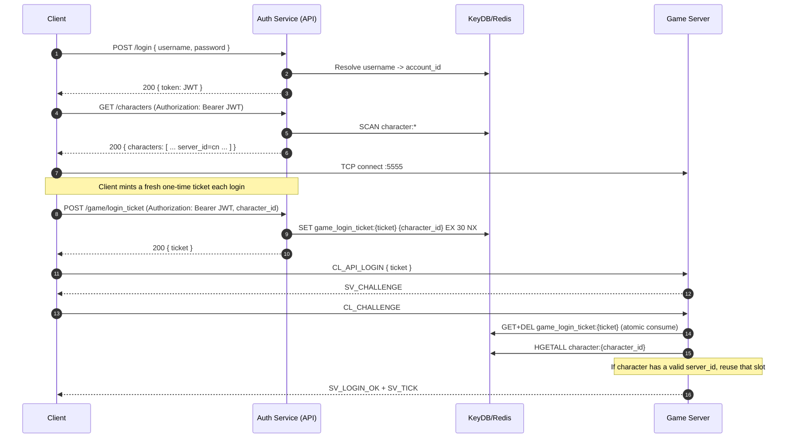

# Authentication Service

This project is an authentication service implemented in Rust. It provides functionalities for user authentication, including user registration and token generation.

# KeyDB setup
The authentication service relies on KeyDB (a high-performance fork of Redis) for storing user data and session information. To set up KeyDB, follow these steps:
1. Install KeyDB: You can download and install KeyDB from the official website: https://keydb.dev/.
2. Start KeyDB: Once installed, start the KeyDB server using the command: `keydb-server --port 5556`.

Eventually we'll have a customized configuration file that is known to work well with the server, but for now the default configuration should work fine.

# Server token generation
The server generates authentication tokens using the `jsonwebtoken` crate. When a user successfully logs in, the server creates a JWT (JSON Web Token) that contains the user's information and an expiration time. The token is signed using a secret key, which is stored securely on the server. The generated token is then sent back to the client, which can use it for subsequent authenticated requests to the server.

The server must have an environment variable defined for the secret key used in token generation. You can set this environment variable in your terminal before running the server:

```bash
export API_JWT_SECRET="your_secret_key_here"
```

You can generate the secret (32+bytes) using either command:

```bash
openssl rand -hex 32
```

or

```bash
python -c "import secrets; print(secrets.token_hex(32))"
```   

# KeyDB data model (key/value layout)

This service stores accounts and characters in KeyDB using a small set of predictable key patterns.

## Key patterns



## Claim keys (uniqueness + lookup)

In addition to the account/character hashes, the service maintains two *claim keys* that act like lightweight unique indexes:

- `account:username:{username_lc}` -> `{account_id}`
- `account:email:{email_lc}` -> `{account_id}`

These are written with an atomic `SET ... NX` operation:

- If the key does not exist, the claim is created and the operation succeeds.
- If the key already exists, the claim fails (meaning the username/email is already taken).

The username claim key is also used to resolve a username directly to an account ID without scanning.

### Pros

- Fast uniqueness enforcement: one atomic write per claim (`SET NX`).
- Fast username->account resolution: single `GET` on the claim key.
- Avoids blocking operations: no `KEYS`, and no full scans of `account:*` for common lookups.

### Cons

- Requires cleanup/update logic: if usernames/emails ever become mutable, you must claim the new value and release the old claim safely.
- Stale claims are possible if an account is deleted without releasing its claim keys.
- Normalization must be consistent: keys assume lowercased values (`username_lc` / `email_lc`).

## Relationships (conceptual)



Notes:
- The `ACCOUNT -> CHARACTER` relationship is materialized via the `account_id` field stored on `character:{character_id}`.
- Username/email uniqueness and username->account resolution are implemented via the claim keys described above.

# Client auth + JWT usage flow

This is the intended client sequence to authenticate via `/login`, receive a JWT, and then call the validated endpoints for character list/create/update/delete.



# Integration with the game server and client applications
The authentication service is designed to be integrated with both the game server and client applications. Over time this is hoped to be a tighter integration.

## Deployment 
The authentication service lives on the same host as the game server and the KeyDB/Redis instance. This is illustrated in the diagram below:



## Communication flow - Account Creation
1. The client application sends a registration request to the authentication service with the desired username, email, and password.
2. The authentication service validates the input and checks for existing accounts with the same username or email.
3. If the registration is successful, the authentication service creates the new account and returns a success response to the client.

Once the account is created, the client can proceed to login and is then able to create characters or play the game with existing characters.

## Communication flow - Login and Character Management
1. The client application sends a login request to the authentication service with the username and password.
2. The authentication service validates the credentials and, if successful, generates a JWT token and returns it to the client.
3. The client stores the JWT token and includes it in the Authorization header for subsequent requests to the authentication service when managing characters.
4. The client can then freely manage characters through the authentication service.

## Communication flow - Playing the game
This is where things get a bit tricky.  Currently the game data is all stored in .dat files that are loaded into memory by the game server at runtime. This means that when an account creates a character, the game server doesn't know about it.  The link gets established when the player logs into the game server for the first time as a new character--this is when the character data gets placed into the char.dat file and assigned a character ID.

The game server will then need to set the character ID on the character hash in the database so that the authentication service can enforce ownership and provide the character list to the client.

### First Login Flow


### Subsequent Login Flow


# Future Improvements
## Security Improvements

## Feature Improvements
- Account management: password reset, email verification, account deletion.
- When a character is deleted - we need to actually remove the character's data from the server; but until we unify the data model and remove the .dat files, we can at least mark the character as deleted in the database and hide it from the character list.