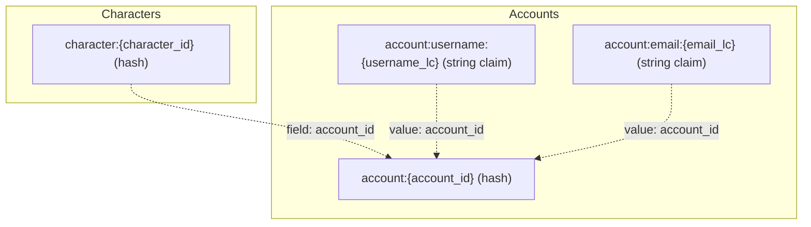
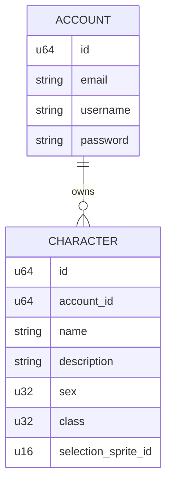
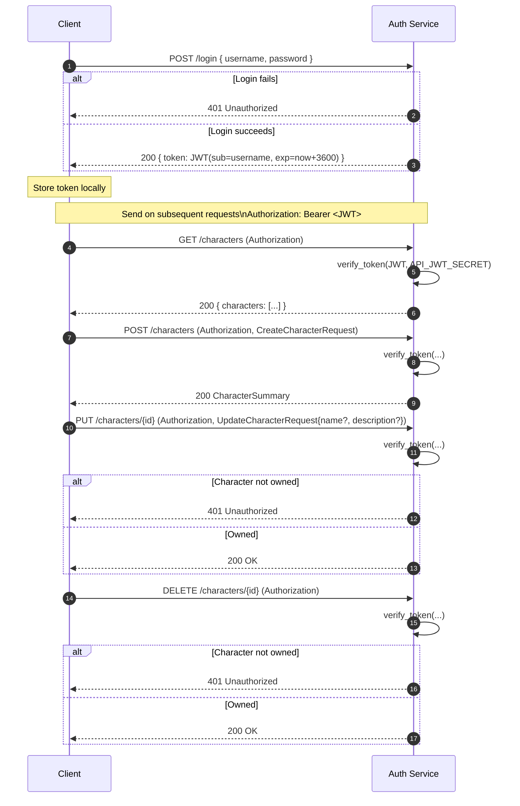
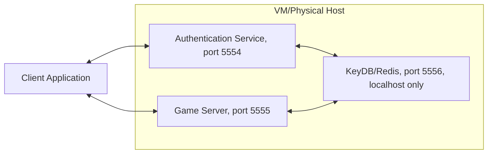
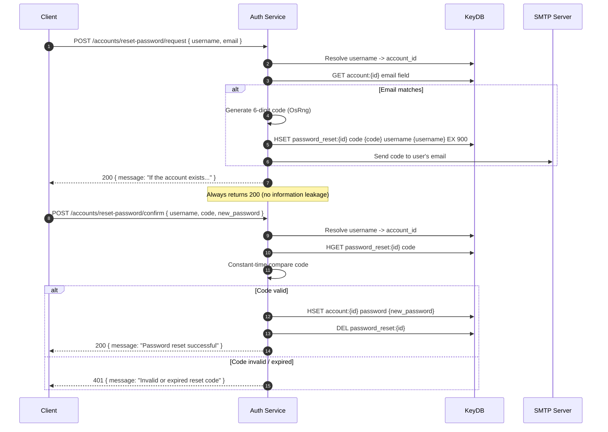
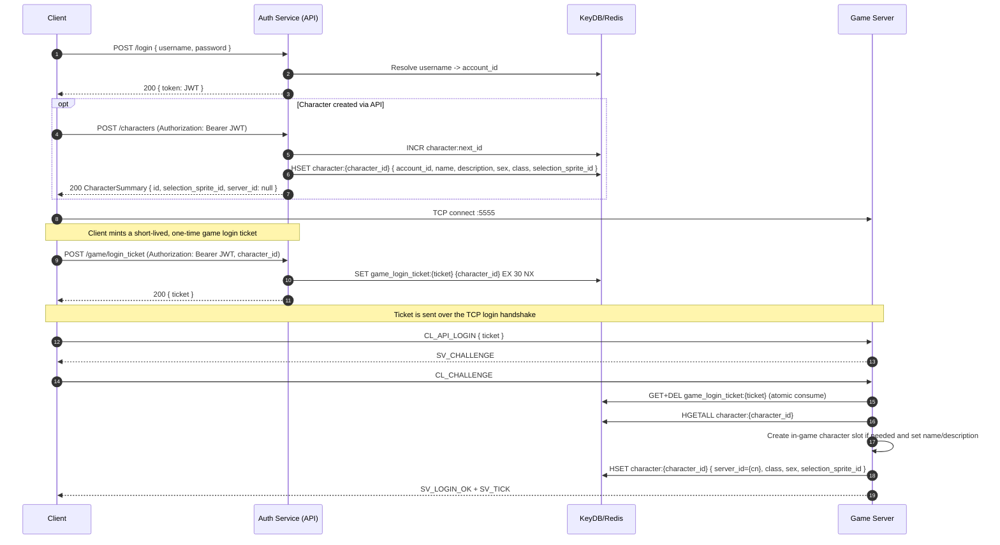
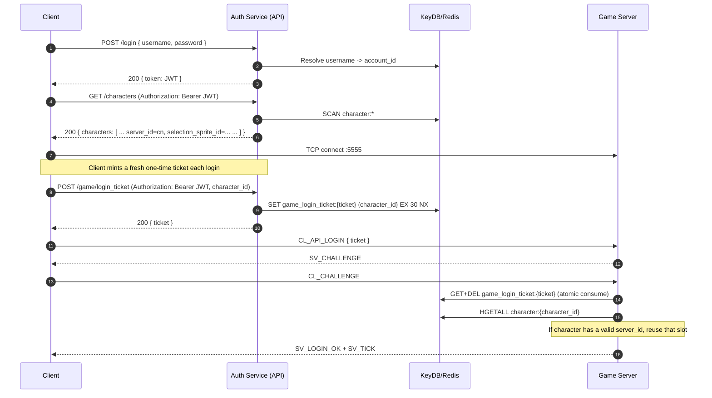

# Authentication Service

This project is an authentication service implemented in Rust. It provides functionalities for user authentication, including user registration and token generation.

# KeyDB setup
The authentication service relies on KeyDB (a high-performance fork of Redis) for storing user data and session information.

Recommended local/prod-like setup is Docker Compose with KeyDB auth enabled.

## Docker Compose quick start

From the repository root:

1. Create an environment file:

```bash
cp .env.example .env
```

2. Set secure values in `.env`:

```bash
API_JWT_SECRET=<long-random-secret>
KEYDB_PASSWORD=<long-random-password>
```

3. Start services:

```bash
docker compose up -d --build
```

On first startup, Compose runs `scripts/generate_certs.sh` in a one-shot `certgen`
service and stores certs in an internal Docker volume. API and game server both
use `/certs/server.crt` + `/certs/server.key` from that volume (mounted read-only).

If you need additional SAN entries (for example, a raw public IP), set:

```bash
TLS_EXTRA_SAN="IP:203.0.113.10" docker compose up -d --build
```

This starts:
- API on `localhost:5554`
- Game server on `localhost:5555`
- KeyDB with password auth on a private compose network

4. Check logs:

```bash
docker compose logs -f api server keydb
```

5. Stop services:

```bash
docker compose down
```

To remove KeyDB persisted data as well:

```bash
docker compose down -v
```

# Server token generation
The server generates authentication tokens using the `jsonwebtoken` crate. When a user successfully logs in, the server creates a JWT (JSON Web Token) that contains the user's information and an expiration time. The token is signed using a secret key, which is stored securely on the server. The generated token is then sent back to the client, which can use it for subsequent authenticated requests to the server.

The API server must have an environment variable defined for the secret key used in token generation. You can set this environment variable in your terminal before running the server:

```bash
export API_JWT_SECRET="your_secret_key_here"
```

You can generate the secret (32+bytes) using either command:

```bash
openssl rand -hex 32
```

or

```bash
python -c "import secrets; print(secrets.token_hex(32))"
```   

# KeyDB data model (key/value layout)

This service stores accounts and characters in KeyDB using a small set of predictable key patterns.

## Key patterns


```mermaid
flowchart TB
    subgraph Accounts
        A_HASH["account:{account_id} (hash)"]
        U_CLAIM["account:username:{username_lc} (string claim)"]
        E_CLAIM["account:email:{email_lc} (string claim)"]
    end

    subgraph Characters
        C_HASH["character:{character_id} (hash)"]
    end

    C_HASH -. "field: account_id" .-> A_HASH

    U_CLAIM -. "value: account_id" .-> A_HASH
    E_CLAIM -. "value: account_id" .-> A_HASH
```

## Claim keys (uniqueness + lookup)

In addition to the account/character hashes, the service maintains two *claim keys* that act like lightweight unique indexes:

- `account:username:{username_lc}` -> `{account_id}`
- `account:email:{email_lc}` -> `{account_id}`

These are written with an atomic `SET ... NX` operation:

- If the key does not exist, the claim is created and the operation succeeds.
- If the key already exists, the claim fails (meaning the username/email is already taken).

The username claim key is also used to resolve a username directly to an account ID without scanning.

### Pros

- Fast uniqueness enforcement: one atomic write per claim (`SET NX`).
- Fast username->account resolution: single `GET` on the claim key.
- Avoids blocking operations: no `KEYS`, and no full scans of `account:*` for common lookups.

### Cons

- Requires cleanup/update logic: if usernames/emails ever become mutable, you must claim the new value and release the old claim safely.
- Stale claims are possible if an account is deleted without releasing its claim keys.
- Normalization must be consistent: keys assume lowercased values (`username_lc` / `email_lc`).

## Relationships (conceptual)


```mermaid
erDiagram
    ACCOUNT ||--o{ CHARACTER : owns

    ACCOUNT {
        u64 id
        string email
        string username
        string password
    }

    CHARACTER {
        u64 id
        u64 account_id
        string name
        string description
        u32 sex
        u32 class
        u16 selection_sprite_id
    }
```

Notes:
- The `ACCOUNT -> CHARACTER` relationship is materialized via the `account_id` field stored on `character:{character_id}`.
- The API-side `CHARACTER` hash stores the current selection/login `class`, `sex`, and server-authored `selection_sprite_id`, not just the original creation-time class.
- Username/email uniqueness and username->account resolution are implemented via the claim keys described above.

# Client auth + JWT usage flow

This is the intended client sequence to authenticate via `/login`, receive a JWT, and then call the validated endpoints for character list/create/update/delete.


```mermaid
sequenceDiagram
    autonumber
    participant C as Client
    participant API as Auth Service

    C->>API: POST /login { username, password }
    alt Login fails
        API-->>C: 401 Unauthorized
    else Login succeeds
        API-->>C: 200 { token: JWT(sub=username, exp=now+3600) }
    end

    Note over C: Store token locally
    Note over C,API: Send on subsequent requests\nAuthorization: Bearer <JWT>

    C->>API: GET /characters (Authorization)
    API->>API: verify_token(JWT, API_JWT_SECRET)
    API-->>C: 200 { characters: [...] }

    C->>API: POST /characters (Authorization, CreateCharacterRequest)
    API->>API: verify_token(...)
    API-->>C: 200 CharacterSummary

    C->>API: PUT /characters/{id} (Authorization, UpdateCharacterRequest{name?, description?})
    API->>API: verify_token(...)
    alt Character not owned
        API-->>C: 401 Unauthorized
    else Owned
        API-->>C: 200 OK
    end

    C->>API: DELETE /characters/{id} (Authorization)
    API->>API: verify_token(...)
    alt Character not owned
        API-->>C: 401 Unauthorized
    else Owned
        API-->>C: 200 OK
    end
```

## Character profile validation
Character names and descriptions are validated by the API before they are stored
or sent to the game server. This replaces the retired in-game `CmdSetUser`
profile finalization packet.

Names must be 4 to 15 ASCII letters, are stored in canonical title case, must
not be `Self`, must be globally unique ignoring ASCII case, must not match a
character template name, and must not contain a configured banned-name pattern
from `game:badnames`.

Descriptions must be printable ASCII, 10 to 200 bytes, must contain the stored
character name exactly, and must not contain double quotes. Updating a linked
character's description is rejected when the live game character has the
`NoDesc` flag set.

# Integration with the game server and client applications
The authentication service is designed to be integrated with both the game server and client applications. Over time this is hoped to be a tighter integration.

## Deployment 
The authentication service lives on the same host as the game server and the KeyDB/Redis instance. This is illustrated in the diagram below:


```mermaid
flowchart LR
    subgraph VM/Physical Host
        API[Authentication Service, port 5554]
        GameServer[Game Server, port 5555]
        KeyDB[KeyDB/Redis, port 5556, localhost only]
    end

    API <--> KeyDB
    GameServer <--> KeyDB

    Client[Client Application] <--> API
    Client[Client Application] <--> GameServer
```

### Container deployment notes

- The compose stack uses `MAG_KEYDB_URL` for both API and game server.
- KeyDB auth is enabled via `--requirepass` and injected from `KEYDB_PASSWORD`.
- KeyDB is not published to host ports by default, reducing external exposure.
- API bind/port are controlled by `API_BIND_ADDR` and `API_PORT`.

## Communication flow - Account Creation
1. The client application sends a registration request to the authentication service with the desired username, email, and password.
2. The authentication service validates the input and checks for existing accounts with the same username or email.
3. If the registration is successful, the authentication service creates the new account and returns a success response to the client.

Once the account is created, the client can proceed to login and is then able to create characters or play the game with existing characters.

## Communication flow - Login and Character Management
1. The client application sends a login request to the authentication service with the username and password.
2. The authentication service validates the credentials and, if successful, generates a JWT token and returns it to the client.
3. The client stores the JWT token and includes it in the Authorization header for subsequent requests to the authentication service when managing characters.
4. The client can then freely manage characters through the authentication service.

## Communication flow - Password Reset
The password reset flow is a two-step process using a 6-digit code sent via e-mail.

### Prerequisites
The API must be configured with SMTP credentials to send e-mails. If `SMTP_HOST` is not set, password reset requests will fail immediately.

| Env var | Description | Default |
|---------|-------------|---------|
| `SMTP_HOST` | SMTP server hostname | *(none — feature disabled)* |
| `SMTP_PORT` | SMTP server port | `587` |
| `SMTP_USER` | SMTP auth username | *(none)* |
| `SMTP_PASSWORD` | SMTP auth password | *(none)* |
| `SMTP_FROM` | Sender address for reset e-mails | *(none)* |

### KeyDB keys used

- `password_reset:{account_id}` — hash with fields `code` and `username`, TTL 900s (15 min).
- `password_reset_attempts:{ip}` — counter with TTL 900s, max 3 per window (per-IP rate limit).

### Flow


```mermaid
sequenceDiagram
    autonumber
    participant C as Client
    participant API as Auth Service
    participant DB as KeyDB
    participant E as SMTP Server

    C->>API: POST /accounts/reset-password/request { username, email }
    API->>DB: Resolve username -> account_id
    API->>DB: GET account:{id} email field
    alt Email matches
        API->>API: Generate 6-digit code (OsRng)
        API->>DB: HSET password_reset:{id} code {code} username {username} EX 900
        API->>E: Send code to user's email
    end
    API-->>C: 200 { message: "If the account exists..." }
    Note over API: Always returns 200 (no information leakage)

    C->>API: POST /accounts/reset-password/confirm { username, code, new_password }
    API->>DB: Resolve username -> account_id
    API->>DB: HGET password_reset:{id} code
    API->>API: Constant-time compare code
    alt Code valid
        API->>DB: HSET account:{id} password {new_password}
        API->>DB: DEL password_reset:{id}
        API-->>C: 200 { message: "Password reset successful" }
    else Code invalid / expired
        API-->>C: 401 { message: "Invalid or expired reset code" }
    end
```

## Communication flow - Playing the game
This is where the API and game server meet. Gameplay world state is persisted in KeyDB and loaded into memory by the game server at startup. Fresh environments are seeded ahead of time from a `.wsnap` world snapshot, so the server starts from KeyDB rather than a removed flat-file backend.

When an account creates a character, the API writes the character metadata to KeyDB immediately. The game server establishes the runtime link the first time the player logs in with a one-time ticket: it loads the character record, creates or reuses the in-game character slot as needed, and then stores the active `server_id` back on the character record so the authentication service can enforce ownership and provide the character list to the client.
After that link exists, the game server also keeps the API-side `class`, `sex`, and `selection_sprite_id` fields synchronized with the live gameplay character so promoted and transformed characters render correctly on the selection screen.

### First Login Flow

```mermaid
sequenceDiagram
    autonumber
    participant C as Client
    participant API as Auth Service (API)
    participant DB as KeyDB/Redis
    participant GS as Game Server

    C->>API: POST /login { username, password }
    API->>DB: Resolve username -> account_id
    API-->>C: 200 { token: JWT }

    opt Character created via API
        C->>API: POST /characters (Authorization: Bearer JWT)
        API->>DB: INCR character:next_id
        API->>DB: HSET character:{character_id} { account_id, name, description, sex, class, selection_sprite_id }
        API-->>C: 200 CharacterSummary { id, selection_sprite_id, server_id: null }
    end

    C->>GS: TCP connect :5555
    Note over C,API: Client mints a short-lived, one-time game login ticket
    C->>API: POST /game/login_ticket (Authorization: Bearer JWT, character_id)
    API->>DB: SET game_login_ticket:{ticket} {character_id} EX 30 NX
    API-->>C: 200 { ticket }

    Note over C,GS: Ticket is sent over the TCP login handshake
    C->>GS: CL_API_LOGIN { ticket }
    GS-->>C: SV_CHALLENGE
    C->>GS: CL_CHALLENGE

    GS->>DB: GET+DEL game_login_ticket:{ticket} (atomic consume)
    GS->>DB: HGETALL character:{character_id}
    GS->>GS: Create in-game character slot if needed and set name/description
    GS->>DB: HSET character:{character_id} { server_id={cn}, class, sex, selection_sprite_id }
    GS-->>C: SV_LOGIN_OK + SV_TICK
```

### Subsequent Login Flow

```mermaid
sequenceDiagram
    autonumber
    participant C as Client
    participant API as Auth Service (API)
    participant DB as KeyDB/Redis
    participant GS as Game Server

    C->>API: POST /login { username, password }
    API->>DB: Resolve username -> account_id
    API-->>C: 200 { token: JWT }

    C->>API: GET /characters (Authorization: Bearer JWT)
    API->>DB: SCAN character:*;
    API-->>C: 200 { characters: [ ... server_id=cn, selection_sprite_id=... ... ] }

    C->>GS: TCP connect :5555
    Note over C,API: Client mints a fresh one-time ticket each login
    C->>API: POST /game/login_ticket (Authorization: Bearer JWT, character_id)
    API->>DB: SET game_login_ticket:{ticket} {character_id} EX 30 NX
    API-->>C: 200 { ticket }

    C->>GS: CL_API_LOGIN { ticket }
    GS-->>C: SV_CHALLENGE
    C->>GS: CL_CHALLENGE

    GS->>DB: GET+DEL game_login_ticket:{ticket} (atomic consume)
    GS->>DB: HGETALL character:{character_id}
    Note over GS: If character has a valid server_id, reuse that slot
    GS-->>C: SV_LOGIN_OK + SV_TICK
```

# Admin template-editing API

The API service optionally exposes an authenticated `/admin/...` surface for
editing live template data (item and character templates) on a running
server. This is intended for trusted operators using the bundled
`template_viewer` tool.

## Enabling the surface

Set `MAG_ADMIN_API_TOKEN` to a random secret of at least 32 bytes
(`openssl rand -hex 32` is fine). When the variable is missing or shorter
than 32 bytes, no `/admin` routes are mounted and the API logs a warning at
startup. The matching server-side reload watcher reads the same token only to
honour `MAG_ADMIN_RELOAD_DISABLED=1` as an emergency lockdown switch — it
never validates tokens (the API is the only authoriser).

## Authentication

All admin requests require:

```
Authorization: Bearer <MAG_ADMIN_API_TOKEN>
```

The token is compared in constant time. Failed authentication attempts are
tracked per IP: 5 failures within 60 seconds trigger a 10-minute lockout
that returns `401` for every request from that IP, even with a valid token.

## Rate limiting

Admin routes are mounted on a sub-router that bypasses the public 1 req/s
governor. Authenticated admin requests are limited to 8 req/s/IP with a
small burst. Excess requests return `429`.

## Endpoints

| Method | Path | Description |
| --- | --- | --- |
| GET | `/admin/templates/items` | List item template summaries (paginated). |
| GET | `/admin/templates/items/{idx}` | Read a single item template (`application/octet-stream`, bincode). |
| PUT | `/admin/templates/items/{idx}` | Replace a single item template (`application/octet-stream`, bincode). |
| GET | `/admin/templates/characters` | List character template summaries. |
| GET | `/admin/templates/characters/{idx}` | Read a single character template (bincode bytes). |
| PUT | `/admin/templates/characters/{idx}` | Replace a single character template (bincode bytes). |
| POST | `/admin/templates/reload` | Ask the running server to swap its in-memory template tables. |
| GET | `/admin/templates/reload/{request_id}` | Poll the lifecycle of a previous reload request. |
| GET | `/admin/world/map` | Bulk-read every map tile (`application/octet-stream`, bincode `Vec<Map>`). |
| GET | `/admin/world/map/version` | Read the admin map-version counter (increments on each accepted patch). |
| GET | `/admin/world/map/{x}/{y}` | Read a single map tile (bincode `Map` bytes). |
| PUT | `/admin/world/map/{x}/{y}` | Enqueue a patch for a single map tile (bincode `MapPatch` bytes). |
| POST | `/admin/world/map/reload` | Ask the running server to drain pending map patches. |
| GET | `/admin/world/map/reload/status` | Poll the lifecycle of a previous map-reload request (query `request_id`). |
| GET | `/admin/world/items` | Bulk-read every item slot (`application/octet-stream`, bincode `Vec<Item>`). |
| GET | `/admin/world/items/list` | Paginated JSON summaries (`from`, `limit` query params; default limit 256, max 4096). |
| GET | `/admin/world/items/version` | Read the admin item-version counter. |
| GET | `/admin/world/items/{id}` | Read a single item (bincode `Item` bytes). |
| PUT | `/admin/world/items/{id}` | Enqueue a patch for a single item (bincode `ItemPatch`). |
| POST | `/admin/world/items/reload` | Ask the running server to drain pending item patches. |
| GET | `/admin/world/items/reload/status` | Poll the lifecycle of a previous item-reload request. |
| GET | `/admin/world/characters` | Bulk-read every character slot (`application/octet-stream`, bincode `Vec<Character>`). |
| GET | `/admin/world/characters/list` | Paginated JSON summaries. |
| GET | `/admin/world/characters/version` | Read the admin character-version counter. |
| GET | `/admin/world/characters/{id}` | Read a single character (bincode `Character` bytes). |
| PUT | `/admin/world/characters/{id}` | Enqueue a patch for a single character (bincode `CharacterPatch`). |
| POST | `/admin/world/characters/reload` | Ask the running server to drain pending character patches. |
| GET | `/admin/world/characters/reload/status` | Poll the lifecycle of a previous character-reload request. |

Full templates use bincode (`application/octet-stream`) instead of JSON to
avoid serialising fixed-size byte arrays through quoted JSON. The
`mag_core::template_store` module exposes the encode/decode helpers so the
client and the server agree on the wire format.

`POST /admin/templates/reload` accepts a JSON body
`{"reload_items": bool, "reload_characters": bool}` and returns
`{"request_id": "...", "status": "pending", "reload_items": ..., "reload_characters": ...}`.
The API enqueues the request via a short-lived KeyDB key
(`game:templates:reload_request`, TTL 30s) and the server's reload watcher
consumes it on the tick thread, swaps the relevant template slices on
`GameState`, and writes
`game:templates:reload_status:{request_id} = applied:{unix_ts}` (TTL 5
minutes) which the GET endpoint exposes.

### Map editing

The admin map surface mirrors the template flow but uses a producer/consumer
queue instead of in-place writes so the running server can apply patches on
its tick thread. `PUT /admin/world/map/{x}/{y}` accepts a bincode `MapPatch`
(coords + static `sprite` / `fsprite` / `flags`); the URL coordinates must
match the body. Patches are appended to `admin:map:patch_queue` and the
version counter `admin:map:version` increments. `POST /admin/world/map/reload`
stamps `admin:map:reload:request` (TTL 30s) and publishes on
`admin:map:reload:channel`; the server drains the queue, applies every patch
(preserving each tile's dynamic fields — `ch`, `to_ch`, `it`, `light`,
`dlight`), then writes
`admin:map:reload:status:{request_id} = applied:{unix_ts}` (TTL 5 minutes).

### Item / character editing

Items and characters use the same producer/consumer pattern as map tiles. A
`PUT /admin/world/items/{id}` body is a bincode
[`ItemPatch`](../core/src/item_store.rs) carrying only the **static authoring
fields** of an [`Item`](../core/src/types/item.rs); the running tick loop
preserves dynamic runtime fields (position, damage state, current age/damage,
runtime sprite override). Characters work the same way — `CharacterPatch`
covers static fields only and the server preserves dynamic state (position,
combat AI, current resources, inventory, networking).

Patches are appended to `game:item:patch_queue` / `game:char:patch_queue`
and the version counters `game:meta:item:version` / `game:meta:char:version`
increment. `POST /admin/world/items/reload` (and the characters equivalent)
stamp `game:item:patch_request` / `game:char:patch_request` (TTL 30s); the
server's watcher consumes them, drains the queue, and writes
`game:item:patch_status:{request_id} = applied:{unix_ts}` (TTL 5 minutes)
for the GET status endpoint.

# Future Improvements
## Security Improvements

When this API is exposed outside a single host, these are the high-impact improvements to reduce risk.


### Password handling

- **Constant-time verification**: use a password verification function that avoids timing leaks.
- **Password policy**: enforce minimum length and reject common/breached passwords (if the game
    targets internet-facing registration).

### JWT hardening

- **Rotate secrets**: support JWT secret rotation (multiple active secrets, `kid` header, phased
    rollout) so a leaked secret can be retired safely.
- **Issuer/audience**: include and validate `iss`/`aud` to prevent tokens minted for another
    environment from being accepted.
- **Short-lived access + refresh tokens**: consider shortening access token TTL and using refresh
    tokens stored server-side (or in a secure store) for better revocation control.
- **Validate algorithm & claims strictly**: explicitly require the expected signing algorithm and
    validate `exp` and other claims defensively.

### KeyDB / Redis security

- **Bind + firewall**: keep KeyDB bound to localhost only (or private network) and block public
    access at the OS/firewall level.
- **Require authentication**: enable KeyDB auth (ACLs / password) even on private networks.
- **Least privilege**: if using ACLs, restrict the API/game server to only the commands and key
    patterns they need.
- **Data retention**: consider TTLs for ephemeral keys (tickets already use TTL) and clarify what
    data must persist.

### Abuse / brute-force resistance

- **Temporary lockouts / backoff**: add progressive delays or temporary lockouts after repeated
    failed login attempts.
- **Audit events**: log authentication events (success/failure) with care not to leak secrets.

### Operational / secret management

- **Don’t log secrets**: ensure request logging never includes passwords, tokens, or ticket values.
- **Secret storage**: load `API_JWT_SECRET` from a secrets manager or OS keychain/secure store in
    production (not checked into files or shell history).

### Optional: API surface hardening

- **Structured error responses**: return consistent JSON error payloads and avoid leaking internal
    details to clients.

## Feature Improvements
- Account management: password reset, email verification, account deletion.
- When a character is deleted - we still need to remove or tombstone the character's gameplay state in KeyDB and reclaim any linked in-world state; until that flow exists, we can at least mark the character as deleted in the database and hide it from the character list.