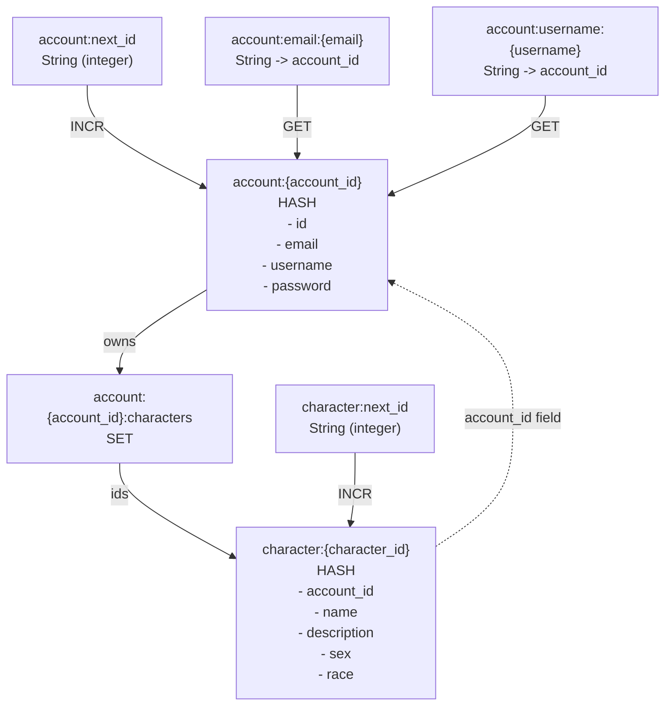

# Authentication Service

This project is an authentication service implemented in Rust. It provides functionalities for user authentication, including user registration and token generation.

# KeyDB setup
The authentication service relies on KeyDB (a high-performance fork of Redis) for storing user data and session information. To set up KeyDB, follow these steps:
1. Install KeyDB: You can download and install KeyDB from the official website: https://keydb.dev/.
2. Start KeyDB: Once installed, start the KeyDB server using the command: `keydb-server --port 5556`.

Eventually we'll have a customized configuration file that is known to work well with the server, but for now the default configuration should work fine.

# Server token generation
The server generates authentication tokens using the `jsonwebtoken` crate. When a user successfully logs in, the server creates a JWT (JSON Web Token) that contains the user's information and an expiration time. The token is signed using a secret key, which is stored securely on the server. The generated token is then sent back to the client, which can use it for subsequent authenticated requests to the server.

The server must have an environment variable defined for the secret key used in token generation. You can set this environment variable in your terminal before running the server:

```bash
export API_JWT_SECRET="your_secret_key_here"
```

You can generate the secret (32+bytes) using either command:

```bash
openssl rand -hex 32
```

or

```bash
python -c "import secrets; print(secrets.token_hex(32))"
```   

# KeyDB data model (key/value layout)

This service stores accounts and characters in KeyDB using a small set of predictable key patterns.

## Key patterns



## Relationships (conceptual)


Notes:
- The `ACCOUNT -> CHARACTER` relationship is materialized primarily via `account:{account_id}:characters` (a set of character IDs), and redundantly via the `account_id` field stored on `character:{character_id}`.
- Username/email uniqueness is enforced via the index keys: `account:username:{username}` and `account:email:{email}`.

# Client auth + JWT usage flow

This is the intended client sequence to authenticate via `/login`, receive a JWT, and then call the validated endpoints for character list/create/update/delete.

