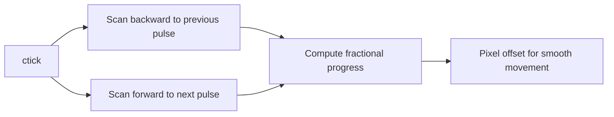
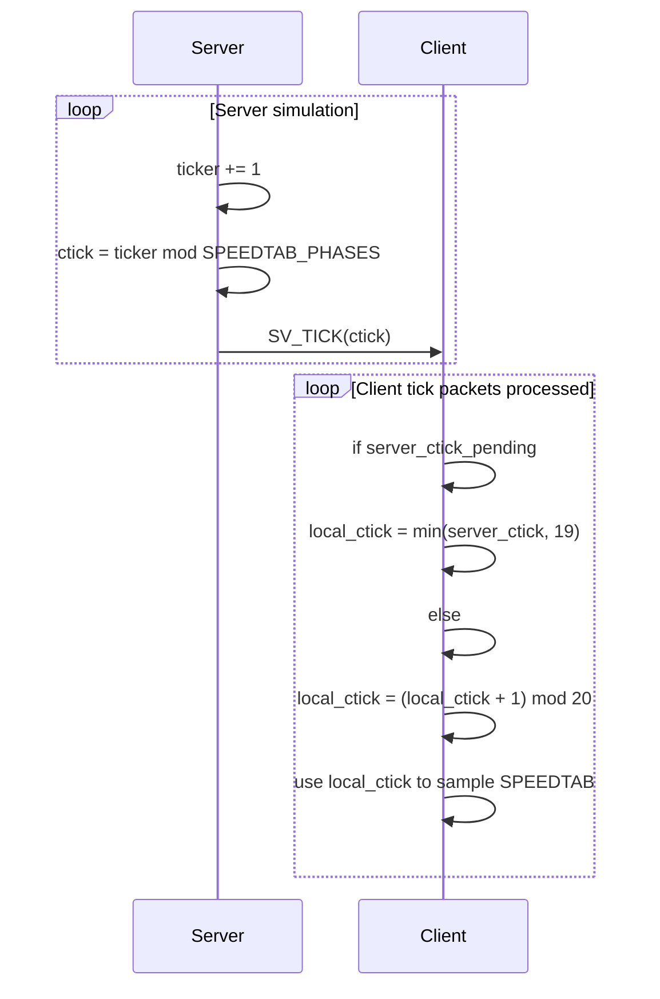

# SPEEDTAB: 20-phase speed scheduling (and how it relates to `TICKS`)

This repo uses a small lookup table (`SPEEDTAB`) to implement many different *effective* movement/animation speeds while still running the simulation on a single global tick loop.

At a high level:

- `TICKS` is the engine's base tick rate (ticks per second).
- `SPEEDTAB` is a fixed 20-phase on/off schedule.
- `ctick` (sometimes called “subtick” or “phase”) is used to index `SPEEDTAB[..][ctick]`.

This design intentionally allows `TICKS` to be **different from 20**.

---

## Where the constants are defined

- `TICKS`, `SPEEDTAB`, and `SPEEDTAB_PHASES` are defined in [core/src/constants.rs](../core/src/constants.rs).

Relevant definitions:

- `pub const TICKS: i32 = ...;` (ticks/sec)
- `pub const TICK: i64 = 1_000_000 / TICKS as i64;` (microseconds per tick)
- `pub const SPEEDTAB_PHASES: usize = 20;` (SPEEDTAB cycle length)
- `pub const SPEEDTAB: [[u8; 20]; 20] = ...;` (20×20 table)

---

## What `SPEEDTAB` represents

`SPEEDTAB` is a **repeating pulse pattern**.

- It has 20 rows: one row per “speed index” (0..19).
- Each row has 20 columns: one column per phase `ctick` (0..19).
- Values are `0` or `1`.

Interpretation:

- `1` => “advance this tick/phase” (e.g., move one step, advance an animation state machine)
- `0` => “don’t advance this tick/phase”

So the core operation is:

```text
advance = SPEEDTAB[speed_index][ctick] != 0
```

### Why 20 phases?

Using a small fixed window (20) is an old-school fixed-point trick:

- “Speed” becomes “how many advances happen in the next 20 phases”.
- The pattern spreads advances out in time to feel smooth and deterministic.

For a given `speed_index`, define:

- `pulses = sum(SPEEDTAB[speed_index][0..20])` (how many `1`s in that row)

Then the normalized speed multiplier is:

$$m = \frac{pulses}{20}$$

---

## How `SPEEDTAB` relates to `TICKS`

### Separate axes: base tick rate vs schedule phase

- `TICKS` controls how often the simulation loop runs per second.
- `SPEEDTAB` controls which of those ticks count as “advance” for a given speed.

If:

- $f = TICKS$ (ticks/sec)
- $pulses =$ number of ones in a given row

and if the code samples one `SPEEDTAB` phase per simulation tick, then:

- A full `SPEEDTAB` cycle takes:

$$\frac{20}{f}\ \text{seconds}$$

- The action advances at:

$$\text{advances/sec} = \frac{pulses}{20} \cdot f$$

### Why it still makes sense when `TICKS` is 18 (original) or 48 (this repo)

If the engine tick rate changes, the 20-phase `SPEEDTAB` schedule still works.

Changing `TICKS` simply changes how quickly we traverse the 20-phase pattern in *real time*.

---

## Important invariant: `SPEEDTAB` is always indexed by a 0..19 phase

Because `SPEEDTAB` is indexed by a `ctick` phase in `0..19`, any phase derived from the global tick counter must be reduced modulo **20** (the SPEEDTAB phase count), not modulo `TICKS`.

In this repo, that phase count is represented by `SPEEDTAB_PHASES` (20), and `ctick` should be computed as:

- `ctick = ticker mod SPEEDTAB_PHASES`

This keeps the schedule stable even if the engine tick rate (`TICKS`) changes.

---

## Server usage (authoritative simulation)

The server uses `SPEEDTAB` as a *gate* to decide whether to advance certain actions.

One concrete call site is `speedo()` in [server/src/player.rs](../server/src/player.rs):

- reads a character’s `speed`
- computes a `ctick`
- returns `SPEEDTAB[speed][ctick]`

```mermaid
flowchart TD
  A[Server tick: globals.ticker increments] --> B[ctick = ticker mod SPEEDTAB_PHASES]
  B --> C[gate = SPEEDTAB[speed_index][ctick]]
  C -->|gate == 1| D[Advance: move/anim/state machine]
  C -->|gate == 0| E[Hold: do nothing this tick]
```

---

## Client usage (visual cadence + smoothing)

The client uses the same table for two related purposes:

1. **Discrete gating** (`speedo`) — should movement/animation advance this phase?
2. **Smooth interpolation** (`speedstep`) — compute pixel offsets between discrete advances.

Both are in [client/src/states/gameplay/legacy_engine.rs](../client/src/states/gameplay/legacy_engine.rs).

### Discrete gating (`speedo`)

Client `speedo(ch_speed, ctick)` clamps inputs and checks `SPEEDTAB[speed][ctick] != 0`.

### Smoothing (`speedstep`)

`speedstep(...)` scans around the current `ctick`:

- walks backward to find the previous pulse
- walks forward to find the next pulse
- uses that spacing to compute a stable sub-frame offset

Conceptually:



---

## Client/server interplay: keeping `ctick` in phase

To keep SPEEDTAB-based animation perfectly in-phase, the client tracks `local_ctick` and can “snap” it based on a server-provided `ctick`.

### Packet: `SV_TICK`

The server sends `SV_TICK` with a 1-byte `ctick` payload. Places where it is sent include login and tick updates in [server/src/player.rs](../server/src/player.rs).

### Client state: `server_ctick` and `local_ctick`

In [client/src/player_state.rs](../client/src/player_state.rs):

- `ServerCommandData::Tick { ctick }` stores a pending `server_ctick`.
- `on_tick_packet()` either:
  - snaps `local_ctick` to `server_ctick.min(19)`, or
  - increments `local_ctick = (local_ctick + 1) % 20`

That behavior is explicitly documented in code as:

> “Using this keeps SPEEDTAB-based animations perfectly in-phase with the server.”

### Conceptual timing



The practical goal is: **both sides sample the same phase of the same pulse pattern** so that the client’s movement smoothing matches the server’s authoritative cadence.

---

## `CL_CMD_CTICK` is different (client heartbeat / timing)

Don’t confuse:

- `ctick` used for SPEEDTAB phases (0..19)

with:

- `CL_CMD_CTICK` (a client command packet type)

In this repo, client `CL_CMD_CTICK` behavior is documented in [client/src/network/mod.rs](../client/src/network/mod.rs): it sends a periodic tick command every 16 processed server ticks.

On the server, `plr_cmd_ctick()` in [server/src/player.rs](../server/src/player.rs) reads a 32-bit `rtick` value and updates bookkeeping (`players[nr].rtick`, `players[nr].lasttick`).

So:

- `CL_CMD_CTICK` is primarily a *client timing/heartbeat* mechanism.
- `SV_TICK`/`ctick` is what keeps SPEEDTAB animations in-phase.

---

## Rules of thumb

- `SPEEDTAB` defines cadence across a 20-phase cycle; it does not require `TICKS == 20`.
- To use `SPEEDTAB` safely, you must index it with:
  - `speed_index` in `0..19`
  - `ctick` in `0..19`
- If you change base tick rate (`TICKS`), you generally do **not** need to change `SPEEDTAB`; the game will simply traverse the 20-phase schedule faster or slower in real time.

---

## Quick mental model

Think of each entity as having a 20-step metronome pattern.

- The server decides, every tick, whether the metronome “hits” for that entity’s speed.
- The client uses the same metronome pattern to animate smoothly.
- `SV_TICK` keeps both sides aligned on which step of the 20-step pattern they are on.
