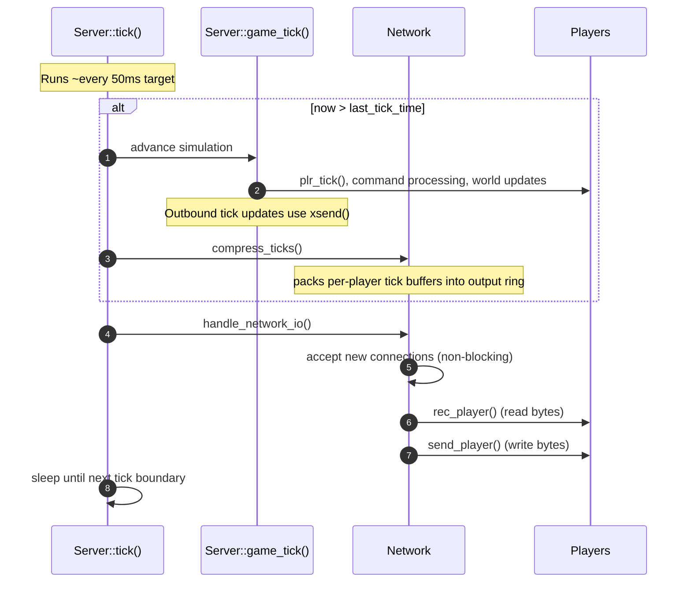
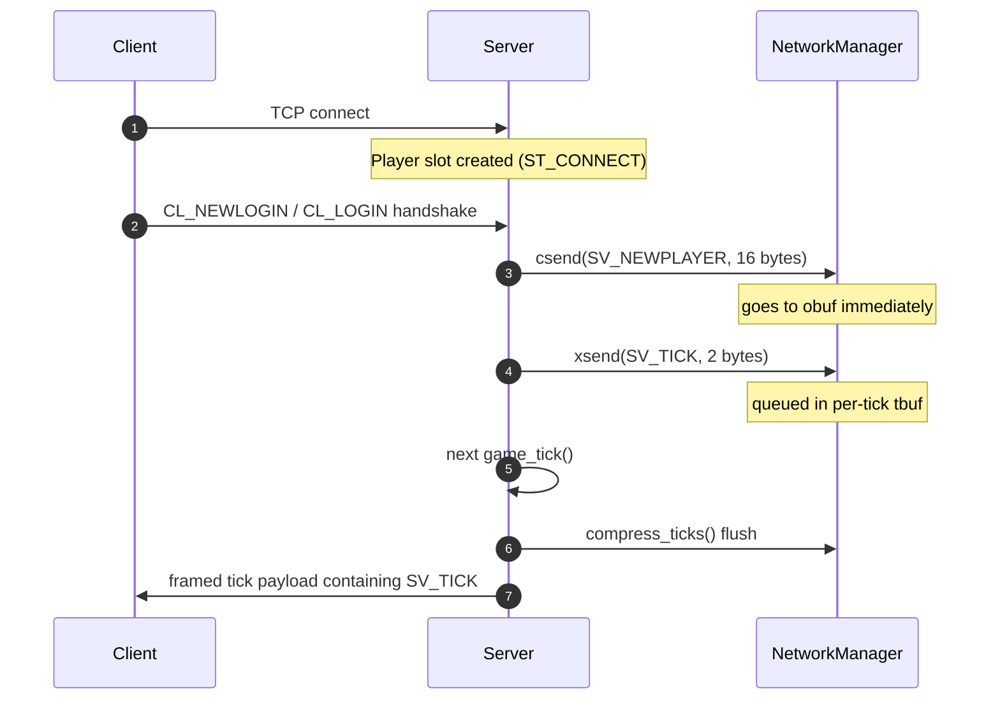
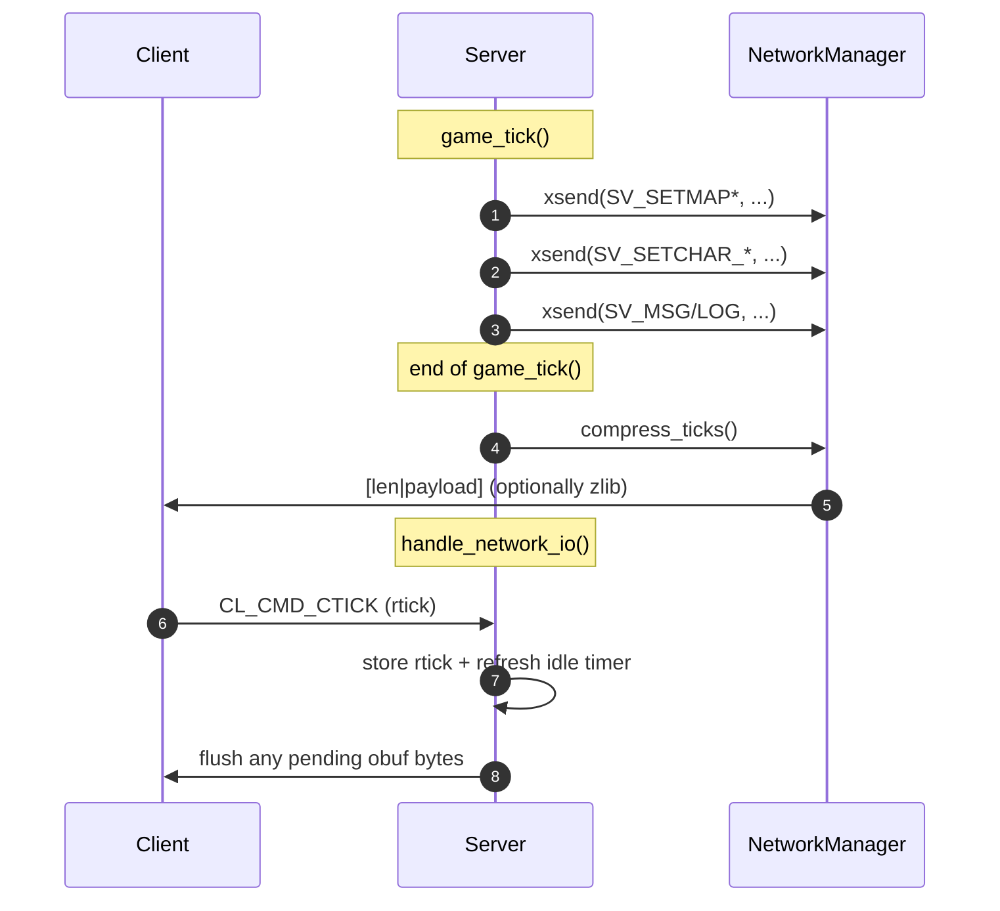

# Men Among Gods Reforged: Server Design

This document describes the server at a **high level**: how the main loop runs, what a “tick” is, how outbound networking is buffered, and when key messages (e.g. `SV_TICK`) are sent.

The details here are based on the current Rust implementation in the `server` crate, which should mirror the C based implementation for now.

## High-Level Architecture

At runtime the server is a single main loop that:

1. Advances world simulation on a fixed-rate **game tick**.
2. Batches and flushes outbound network messages.
3. Polls sockets for input and output.

Key modules:

- `Server` (`server/src/server.rs`): owns the listener socket and runs the tick scheduler.
- `Repository` (`server/src/repository.rs`): global, in-memory game state (characters/items/map/globals).
- `State` (`server/src/state/*`): higher-level game rules and “do_*” actions.
- `player` (`server/src/player.rs`): client protocol handling and per-player bookkeeping.
- `NetworkManager` (`server/src/network_manager.rs`): outbound buffering and packet stats.
- Subsystems ticked each game tick: `populate`, `EffectManager`, `driver::item_tick`, and global time/daylight logic.

## Tick Rate

The server targets **20 ticks per second**:

- `core::constants::TICKS = 20`
- `core::constants::TICK = 1_000_000 / TICKS` microseconds

So a single tick is ~$50ms$.

### Scheduler behavior

`Server::tick()` maintains an `Instant` (`last_tick_time`) and advances the simulation when real time passes the scheduled tick boundary.

- If the server falls behind by more than ~10 seconds, it logs “Server too slow” and resets the tick baseline.
- The loop sleeps the remaining time to maintain the target cadence.

## Main Loop Overview

The main loop in `server/src/main.rs` continuously calls `server.tick()` until shutdown.

`Server::tick()` has two “layers”:

- **Game tick layer** (fixed cadence): runs world logic and batches outbound per-tick messages.
- **I/O polling layer** (every scheduling iteration): accepts new sockets, reads from clients, and flushes buffered output.

### Per-iteration sequence

Important implication of the ordering above:

- **Inbound bytes read during `handle_network_io()` are generally processed on the next `game_tick()`**, because `game_tick()` runs before `rec_player()` within a single scheduling iteration.

## Networking: `csend` vs `xsend`

The server has two distinct outbound paths that trade latency vs batching/compression.

### `csend(player_id, bytes, length)`

**What it does**

- Writes directly into the player’s **circular output ring buffer** (`obuf`).
- `send_player()` later flushes `obuf` to the TCP socket.

**Why it exists**

- This is the “immediate/out-of-band” send path for small fixed-size protocol packets.

**Failure mode**

- If the ring buffer would become full, the server treats the client as too slow and disconnects (`ClientTooSlow`).

### `xsend(player_id, bytes, length)`

**What it does**

- Appends bytes to the player’s **tick buffer** (`tbuf`).
- The tick buffer is not written to the socket immediately.
- On the next `compress_ticks()` call, the server packages that tick buffer into the output ring (`obuf`), optionally compressed.

**Why it exists**

- This is the “batched per-tick update” path.
- It enables aggregation (many small messages become one framed payload) and compression.

**Failure mode**

- If `tbuf` would overflow, the server logs an internal error and terminates the connection.

### Practical rule of thumb

- Use `csend` for **immediate protocol/control packets** (login responses, small acks).
- Use `xsend` for **tick-synchronous world updates** (map changes, stat deltas, per-tick updates).

In general this is likely an optimization that isn't needed anymore given modern networking stacks, but it is preserved here to match the legacy server behavior.  Well, that and there is no reason to not be efficient with bandwidth where possible!

## Tick Packet Framing and Compression

Tick-buffer data (`tbuf`) is flushed by `Server::compress_ticks()`.

Each flush writes into `obuf` a framed record:

1. A **2-byte length header** (taken from the first two bytes of a native-endian `int` in the legacy protocol).
2. A **payload** which is the raw `tbuf` bytes, either:
	 - uncompressed, or
	 - compressed with zlib and flagged as compressed.

### Length header semantics

- Uncompressed: `olen = payload_len + 2`
- Compressed: `olen = (payload_len + 2) | 0x8000`

The high bit `0x8000` signals compression.

### Payload semantics

The payload is a **byte stream of server messages** queued via `xsend()`.

- Each message begins with a 1-byte opcode (e.g. `SV_SETMAP*`, `SV_TICK`).
- Message sizes are inferred by the client based on the opcode.

Here is a full list of the op-codes with a brief description of each:
- `SV_EMPTY (0)`: No-op/empty message; used as a placeholder in the protocol.
- `SV_CHALLENGE (1)`: Login handshake challenge; server sends to prove liveness and gate authentication.
- `SV_NEWPLAYER (2)`: Binds the TCP connection to a character id + session keys; server sends after successful new login.
- `SV_SETCHAR_NAME1 (3)`: Character name update (part 1); server sends when the client needs name state.
- `SV_SETCHAR_NAME2 (4)`: Character name update (part 2); server sends when the client needs name state.
- `SV_SETCHAR_NAME3 (5)`: Character name update (part 3); server sends when the client needs name state.
- `SV_SETCHAR_MODE (6)`: Character mode/state update (e.g. stance/mode flags); server sends when mode changes.
- `SV_SETCHAR_ATTRIB (7)`: Character attribute block (base stats); server sends when attributes change or on login.
- `SV_SETCHAR_SKILL (8)`: Skill values update; server sends when skill levels change or on login.
- `SV_SETCHAR_HP (12)`: HP update; server sends when health changes.
- `SV_SETCHAR_ENDUR (13)`: Endurance update; server sends when endurance/stamina changes.
- `SV_SETCHAR_MANA (14)`: Mana update; server sends when mana changes.
- `SV_SETCHAR_AHP (20)`: “Active/augmented” HP update used for client-side bars/derived values; server sends when the active value changes.
- `SV_SETCHAR_PTS (21)`: Points/XP update; server sends when points totals change.
- `SV_SETCHAR_GOLD (22)`: Gold/currency update; server sends when money changes.
- `SV_SETCHAR_ITEM (23)`: Inventory item slot update; server sends when inventory contents change.
- `SV_SETCHAR_WORN (24)`: Equipped/worn item update; server sends when equipment changes.
- `SV_SETCHAR_OBJ (25)`: Character “object”/aux slot update; server sends when associated objects change.
- `SV_TICK (27)`: Tick phase marker (`0..TICKS-1`); server sends to synchronize client timing and support lag/keepalive logic.
- `SV_LOOK1 (29)`: Look/inspect response (part 1); server sends when responding to look requests.
- `SV_SCROLL_RIGHT (30)`: Scroll camera/view right; server sends when movement shifts the client viewport.
- `SV_SCROLL_LEFT (31)`: Scroll camera/view left; server sends when movement shifts the client viewport.
- `SV_SCROLL_UP (32)`: Scroll camera/view up; server sends when movement shifts the client viewport.
- `SV_SCROLL_DOWN (33)`: Scroll camera/view down; server sends when movement shifts the client viewport.
- `SV_LOGIN_OK (34)`: Login success acknowledgment; server sends when authentication completes.
- `SV_SCROLL_RIGHTUP (35)`: Scroll camera/view diagonally right+up; server sends when movement shifts the viewport.
- `SV_SCROLL_RIGHTDOWN (36)`: Scroll camera/view diagonally right+down; server sends when movement shifts the viewport.
- `SV_SCROLL_LEFTUP (37)`: Scroll camera/view diagonally left+up; server sends when movement shifts the viewport.
- `SV_SCROLL_LEFTDOWN (38)`: Scroll camera/view diagonally left+down; server sends when movement shifts the viewport.
- `SV_LOOK2 (39)`: Look/inspect response (part 2); server sends when responding to look requests.
- `SV_LOOK3 (40)`: Look/inspect response (part 3); server sends when responding to look requests.
- `SV_LOOK4 (41)`: Look/inspect response (part 4); server sends when responding to look requests.
- `SV_SETTARGET (42)`: Target selection update; server sends when the client’s current target should change.
- `SV_SETMAP2 (43)`: Map/tile update (encoding variant #2); server sends to update the client’s visible map.
- `SV_SETORIGIN (44)`: Sets the client’s coordinate origin for subsequent relative updates; server sends to reduce payload size.
- `SV_SETMAP3 (45)`: Map/tile update (encoding variant #3); server sends to update the client’s visible map (often light/visibility related).
- `SV_SETCHAR_SPELL (46)`: Spell slot/list update; server sends when spell inventory changes.
- `SV_PLAYSOUND (47)`: Play a sound effect; server sends to trigger client audio.
- `SV_EXIT (48)`: Forced client exit; server sends on logout/kick/shutdown or fatal protocol errors.
- `SV_MSG (49)`: Text message (chat/system); server sends to inform players.
- `SV_LOOK5 (50)`: Look/inspect response (part 5); server sends when responding to look requests.
- `SV_LOOK6 (51)`: Look/inspect response (part 6); server sends when responding to look requests.
- `SV_LOG (52)`: Log line (generic); server sends to display server-originated log text to the client.
- `SV_LOG0 (52)`: Log line channel 0; server sends to categorize log output for the client UI.
- `SV_LOG1 (53)`: Log line channel 1; server sends to categorize log output for the client UI.
- `SV_LOG2 (54)`: Log line channel 2; server sends to categorize log output for the client UI.
- `SV_LOG3 (55)`: Log line channel 3; server sends to categorize log output for the client UI.
- `SV_LOAD (56)`: Loading/progress/control message; server sends during login/map loads to coordinate client state.
- `SV_CAP (57)`: Player-cap/queue status; server sends when the server is full and the client is queued.
- `SV_MOD1 (58)`: Modifier update (slot 1); server sends when client-visible modifiers/buffs change.
- `SV_MOD2 (59)`: Modifier update (slot 2); server sends when client-visible modifiers/buffs change.
- `SV_MOD3 (60)`: Modifier update (slot 3); server sends when client-visible modifiers/buffs change.
- `SV_MOD4 (61)`: Modifier update (slot 4); server sends when client-visible modifiers/buffs change.
- `SV_MOD5 (62)`: Modifier update (slot 5); server sends when client-visible modifiers/buffs change.
- `SV_MOD6 (63)`: Modifier update (slot 6); server sends when client-visible modifiers/buffs change.
- `SV_MOD7 (64)`: Modifier update (slot 7); server sends when client-visible modifiers/buffs change.
- `SV_MOD8 (65)`: Modifier update (slot 8); server sends when client-visible modifiers/buffs change.
- `SV_SETMAP4 (66)`: Map/tile update (encoding variant #4); server sends to update the client’s visible map.
- `SV_SETMAP5 (67)`: Map/tile update (encoding variant #5); server sends to update the client’s visible map.
- `SV_SETMAP6 (68)`: Map/tile update (encoding variant #6); server sends to update the client’s visible map.
- `SV_SETCHAR_AEND (69)`: “Active/augmented” endurance update; server sends when derived endurance changes.
- `SV_SETCHAR_AMANA (70)`: “Active/augmented” mana update; server sends when derived mana changes.
- `SV_SETCHAR_DIR (71)`: Facing direction update; server sends when direction changes.
- `SV_UNIQUE (72)`: Unique/entropy handshake response; server sends to complete `CL_CMD_UNIQUE` flows.
- `SV_IGNORE (73)`: Ignore-list update; server sends when ignore state changes.
- `SV_SETMAP (128+)`: Bulk/short map update opcodes (128–255 reserved); server sends high-volume tile updates efficiently.

## `SV_TICK` and Client Tick Reporting

`SV_TICK` is a 2-byte server message:

- Byte 0: `SV_TICK` opcode (`27`)
- Byte 1: a tick phase in `0..TICKS-1`

In the current Rust server, that phase is sent as:

- `globals.ticker % TICKS` during login/newlogin.

The legacy C++ server maintained a separate `ctick` counter which increments each game tick and wraps at 20; functionally it is also a `0..19` phase value.

### Client → Server: `CL_CMD_CTICK`

Clients periodically send `CL_CMD_CTICK` containing a 32-bit `rtick` value. The server:

- stores it in `players[nr].rtick`
- updates `players[nr].lasttick` (idle timeout/keepalive)

The server increments `players[nr].ltick` each tick while in `ST_NORMAL` and compares `ltick` vs `rtick` to detect excessive lag and (optionally) apply “stoning” as a gameplay constraint.

## Message Timing Diagrams

### Login / New Character Creation (showing `SV_TICK`)

`SV_NEWPLAYER` is sent via `csend` (immediate), while `SV_TICK` is queued via `xsend` (delivered on the next `compress_ticks()` flush).

### Typical Tick: `xsend` batching vs `csend` immediacy

## Notes / Known Sharp Edges

- Because `game_tick()` runs before `rec_player()` inside a scheduling iteration, input commonly incurs up to one tick of delay before affecting simulation.
- `SV_TICK` is currently emitted during login flows; most other per-tick updates are sent as `xsend` messages batched into the tick payload.

